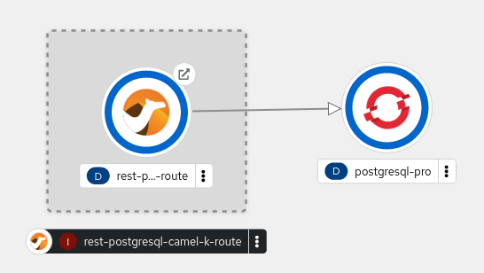

# Camel-K Sample CICD Pipeline

This repository is specialized one from the original one described in the
[Camel K CICD](https://camel.apache.org/blog/2022/10/camel-k-cicd/) blog post including
the following features:

* Deployed on OpenShift 4.11
* Tekton Pipelines provided by Red Hat OpenShift Pipelines 1.8.0
* Integration capabilities provided by Camel K 1.10.1

This repository implements a simple CICD pipeline to promote an integration
route from a _development_ environment to a _production_ environment.


The sample integration route is a REST API to insert, select and delete records
from a table in a database.



## Environment

This project requires an Red Hat OpenShift Container Platform available. If you do
not have one, you could use one of the following resources to deploy locally one:

* [Camel CLI 1.10](https://camel.apache.org/camel-k/1.10.x/cli/cli.html)
* [CodeReady Containers - OpenShift 4 on your Laptop](https://github.com/code-ready/crc)

This repo was tested with the following latest versions of Kamel CLI and
CodeReady Containers:

```shell
❯ kamel version
Camel K Client 1.10.1
❯ crc version
CRC version: 2.10.1+426703d
OpenShift version: 4.11.7
Podman version: 4.2.0
```

### Installing Kamel CLI

Download the right binary of your platform from the
[GitHub Releases](https://github.com/apache/camel-k/releases/tag/v1.10.1),
and install in the command path of your system.

### Starting CodeReady Containers

To start up your OpenShift Local cluster:

```shell
❯ crc setup
❯ crc start -p /PATH/TO/your-pull-secret-file.json
```

You could promote `developer` user as `cluster-admin` with the following command:

```shell
❯ oc adm policy add-cluster-role-to-user cluster-admin developer
clusterrole.rbac.authorization.k8s.io/cluster-admin added: "developer"
```

### Development and Production Environments

This repository will use two different namespaces to represent the _development_
and _production_ environments:

* Development environment will be created in the _kamel-dev_ namespace
* Production environment will be created in the _kamel-pro_ namespace

To create both namespaces:

```shell
oc new-project kamel-dev
oc new-project kamel-pro
```

## Deploying OpenShift Operators

To deploy the different OpenShift operators it is required a user with
`cluster-admin` role.

Red Hat OpenShift Pipelines will be deployed globally in the cluster:

```shell
oc apply -f ./operators -n openshift-operators
```

Using the Camel CLI capabilities, we will install the operator using the
following commands:

```shell
kamel install -n kamel-dev
kamel install -n kamel-pro
```

You could check that operators are successfully registered with the following command:

```shell
❯ oc get csv
NAME                                     DISPLAY                       VERSION   REPLACES                   PHASE
camel-k-operator.v1.10.1                 Camel K Operator              1.10.1    camel-k-operator.v1.10.0   Succeeded
openshift-pipelines-operator-rh.v1.8.0   Red Hat OpenShift Pipelines   1.8.0                                Succeeded
```

## Deploying Development Resources

Deploy Database instance for _development_ environment:

```shell
oc apply -f db/dev -n kamel-dev
oc create secret generic my-datasource --from-file db/dev/datasource.properties -n kamel-dev
```

We will wait until the instance is up and running:

```shell
$ watch -n 1 oc get pod -l app=postgresql-dev -n kamel-dev -o jsonpath='{.items[0].status.phase}'
Every 1.0s: oc get pod -l app=postgresql-dev -n kamel-dev -o jsonpath={.items[0].status.phase}                                                         redhat: Wed Oct 19 08:36:14 2022

Running
```

Now, we could create the table used by the integration route:

```shell
$ oc exec -it $( oc get pod -l app=postgresql-dev -n kamel-dev -o jsonpath='{.items[0].metadata.name}') -n kamel-dev -- psql -U postgresadmin --password postgresdb -c 'CREATE TABLE customers (name TEXT PRIMARY KEY, city TEXT)'
Password for user postgresadmin: 
CREATE TABLE
```

**NOTE**: It is required to type the administrator password (E.g: _admin123_)

## Deploying Production resources

Deploy Database instance for _production_ environment:

```shell
oc apply -f db/pro/conf.yml -n kamel-pro
oc create secret generic my-datasource --from-file db/pro/datasource.properties -n kamel-pro
```

We will wait until the instance is up and running:

```shell
watch -n 1 oc get pod -l app=postgresql-pro -n kamel-pro -o jsonpath='{.items[0].status.phase}'
```

Now, we could create the table used by the integration route:

```shell
oc exec -it $(oc get pod -l app=postgresql-pro -n kamel-pro -o jsonpath='{.items[0].metadata.name}') -n kamel-pro -- psql -U postgresadmin --password postgresdb -c 'CREATE TABLE customers (name TEXT PRIMARY KEY, city TEXT)'
```

**NOTE**: It is required to type the administrator password (E.g: _admin123_)

## Deploying Pipeline

The pipeline uses a set of different `Task` and `ClusterTask` provided by OpenShift
Pipelines, so we need to deploy before the pipeline definition.

**NOTE**: The CICD pipeline will run in the _development_ namespace:

```shell
oc apply -f cicd/tasks -n kamel-dev
```

Deploy Pipeline

```shell
oc apply -f cicd/kamel-k-cicd-pipeline.yml -n kamel-dev
```

Before starting the pipeline is needed to apply extra privileges to the
`camel-k-operator` Service Account used by Camel K to allow operate some
resources in the _production_ environment from the _development_ environment.

```shell
oc policy add-role-to-user edit system:serviceaccount:kamel-dev:camel-k-operator -n kamel-pro
```

For more details about how to grant more privileges to a Service Account, please
review the [Understanding and creating service accounts](https://docs.openshift.com/container-platform/4.11/authentication/understanding-and-creating-service-accounts.html) article.


## Running Tekton Pipeline

To start a pipeline will need a `PipelineRun` definition. 

```shell
oc create -f cicd/kamel-k-cicd-pipelinerun.yml -n kamel-dev
```

To list the current pipeline runs you could use the Tekton CLI

```shell
❯ tkn pipelinerun list -n kamel-dev
NAME                                    STARTED        DURATION   STATUS
kamel-k-cicd-pipelinerun-1-10-1-wkl9r   1 minute ago   ---        Running
```

And to follow the output logs of that pipeline run:

```shell
❯ tkn pipelinerun logs kamel-k-cicd-pipelinerun-1-10-1-vlbx7 -n kamel-dev -f
```

## Testing Integration Routes

If the pipeline run successfully then we could use the REST API in the
_production_ environment:

To create an entry into the database:

```shell
curl --header "Content-Type: application/json" \
  --request POST \
  --data '{"name":"camel-k","city":"Integration City"}' \
  http://$(oc get route rest-postgresql-camel-k-route -o jsonpath='{.spec.host}' -n kamel-pro)/customers/
```

To get all the items from the database:

```shell
❯ curl \
    http://$(oc get route rest-postgresql-camel-k-route -o jsonpath='{.spec.host}' -n kamel-pro)/customers | jq -r '.' | jq .
[
  {
    "name": "camel-k",
    "city": "Integration City"
  }
]    
```

To consume the new entry from the database:

```shell
❯ curl \
    http://$(oc get route rest-postgresql-camel-k-route -o jsonpath='{.spec.host}' -n kamel-pro)/customers/camel-k | jq -r '.' | jq .
[
  {
    "name": "camel-k",
    "city": "Integration City"
  }
]    
```

To delete an entry from the database:

```shell
curl -o /dev/null \
  -s \
  -w "%{http_code}\n" \
  --request DELETE \
  http://$(oc get route rest-postgresql-camel-k-route -o jsonpath='{.spec.host}' -n kamel-pro)/customers/camel-k
```

## Common Issues

### Unable to promote route

During the promotion to the _production_ namespace the following exception could happen:

```text
2022/10/19 08:19:48 warning: unsuccessful cred copy: ".docker" from "/tekton/creds" to "/": unable to create destination directory: mkdir /.docker: permission denied
Error: could not validate destination resources: 
	Secret my-datasource is missing from kamel-pro namespace
```

This means that the _ServiceAccount_ executing the task has not the right privileges to manage
and operate from the _development_ namespace into the _production_ namespace. Please, review
that you applied the right privileges into the _camel-k-operator_ service account in the
_development_ namespace, where the pipelines are running.
